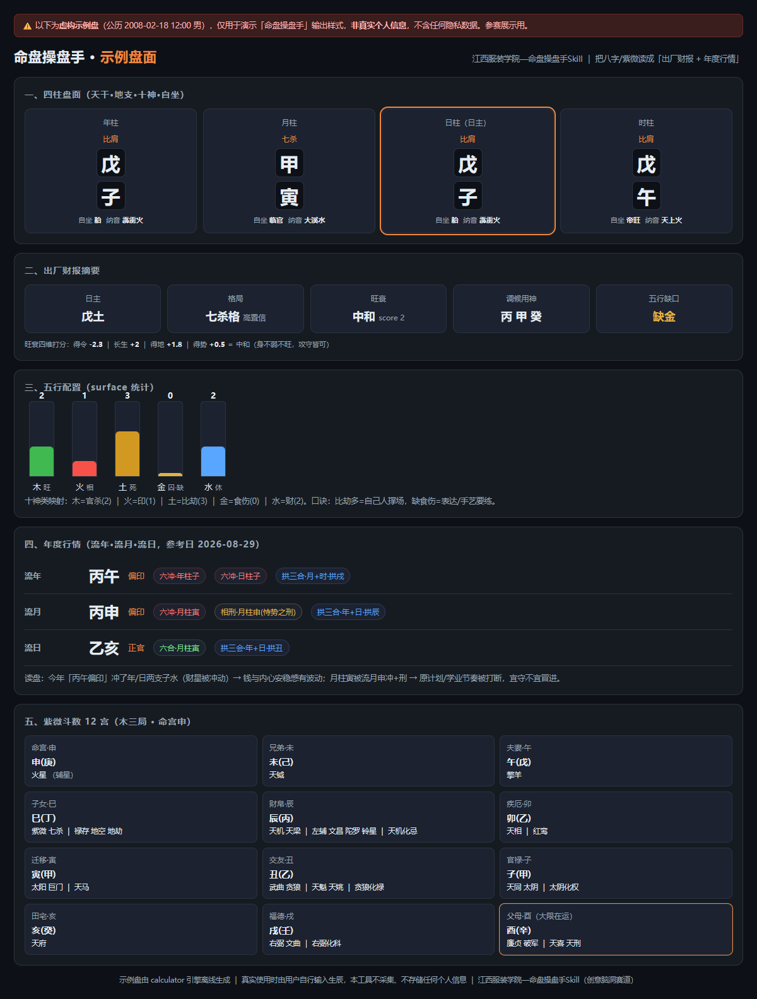

# 江西服装学院—命盘操盘手Skill

> SkillHub「宝藏母校 Skill 大赛」参赛作品 · 创意脑洞赛道
> 由江西服装学院在校学生为同校新生打造的「迎新破冰 + 财商启蒙」趣味工具
>
> 一句话：**你的生辰不是命运判决书，是一份「出厂财报 + 年度行情」；再叠上时代、土地、经历，
> 就是一张「天时地利人和」操盘地图。** 盘面由算法精准产出，怎么读，由 AI 套一套财管语言给你——
> 用资产配置 / 仓位 / 现金流的话术，说清你该在何时、何地、联合谁、做啥。纯文化体验，不预测吉凶。

详细说明见 [SKILL.md](./SKILL.md)（含核心财管逻辑、天时地利人和三维框架、专业术语→大白话翻译表、
多轮/单轮双模式问答 intake、人物画像、职业底色库、傻瓜使用指南、9 个案例讲解、解读框架、运行环境适配）。

## 作品展示

引擎对一个**虚构示例盘**（公历 2008-02-18 12:00 男）跑出的盘面截图，参赛页/自述可直接用：



（盘面仅演示格式与排版风格，**非真实个人信息**；真实使用时由用户自行输入生辰，本工具不采集、不存储。）

可交互的 HTML 盘面见 [showcase.html](./showcase.html)，原始 JSON 见 [showcase_chart.json](./showcase_chart.json)。

## 它特别在哪

- **硬核不套话**：不是 AI 画张 K 线图凑热闹，是用真财管框架（五行=资产 / 身强身弱=仓位 /
  十神=现金流 / 流年=行情）解构八字——市面上独一份。
- **专业术语大白话翻译**：命理黑话（身强身弱 / 十神 / 调候用神…）全翻成"人话"+操盘比喻，
  大众零门槛接住——专业的东西翻译给大众听懂，是这次升级的核心。
- **天时地利人和三维框架（核心升级）**：在精准盘面之上叠加①天时（出生盘 + 时代九运 Beta）
  ②地利（所在地五行方位）③人和（个人经历自述），把单层排盘升级成"何时/何地/联合谁/做啥"
  的立体地图——市面八字工具几乎没有做全三维的。
- **先问后解（双模式问答 intake）**：被调用先引导用户说出全维度背景——身份 / 生辰 / 出生地(具体到县镇、
  在哪儿读书) / 家庭环境 / 经历，再给针对性方案，不是丢生辰吐模板。**能多轮的 agent 逐轮深挖 +
  交付回扣确认（反复互动贯穿全程）；不能多轮的 agent 一次性发问卷**，两种都保证背景问全再解读。
- **职业底色库**：覆盖注册会计师 / 软件开发 / 公务员 / 教师 / 销售创业 / 设计 / 医护 / 学生 /
  银发，男女老少食通用——同一份盘用对应职业的操盘语言讲，对方秒懂。
- **多视角立体**：同一份盘，能从心理学（MBTI）、历史学（曾国藩 / 胡雪岩）、社会学（人脉资本）、
  游戏化（角色面板）四个角度讲，不同背景的人都能秒懂。
- **跨智能体适配**：SKILL.md 是方法论提示词（任何 agent 可加载），calculator/ 是 node 引擎
  （能跑 node 才用）；联网搜索写成能力声明式，有 web 拉实时背景、无 web 用内置九运/方位表——
  WorkBuddy / Trae / Codex / 国产 agent 一份文档通吃。
- **精准小众**：自研引擎 + 节气校正 + 晚子时次日派 + 流年流月流日动态行情层，盘面可复现。

## 快速开始

```bash
cd calculator
npm install
node dist/run-chart.js --year=2005 --month=3 --day=12 --hour=8 --minute=30 --gender=male --ref-date=2026-08-29
node dist/dump-text.js --input=chart.json
```

把 `dump-text.js` 的输出交给 AI，AI 按 SKILL.md「解读框架」产出第二段引导（江西服装学院—命盘操盘手版）。

## 作者

LK666-A11Y · 江西服装学院 · 财务管理 2024级

## License

MIT
